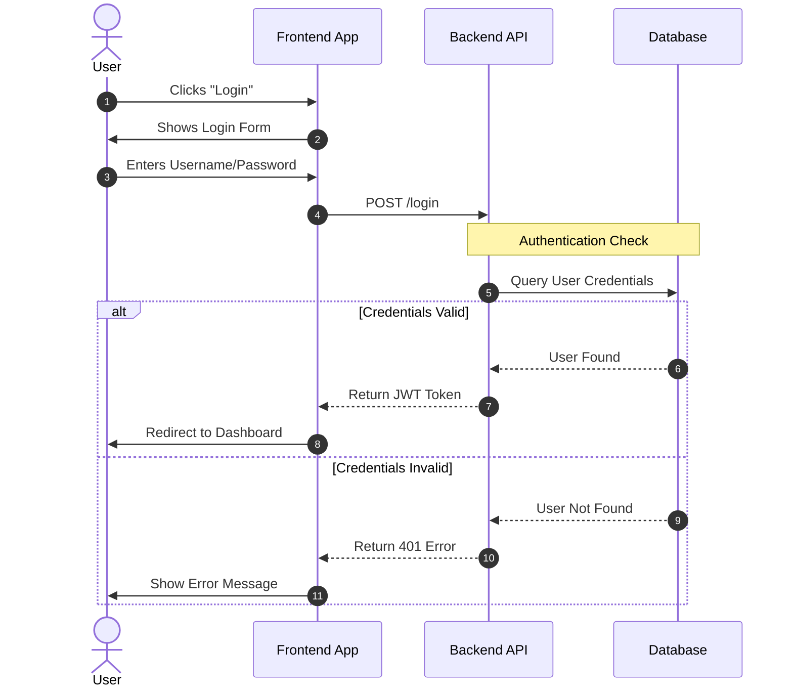

# Project Workflow Documentation

This document outlines the high-level workflow for our authentication service to test Mermaid rendering.

## 1. User Login Flow
This sequence diagram illustrates how a user logs into the system. It tests complex interactions and loops.

## abc
more text here

## part 3
fjlksfj
